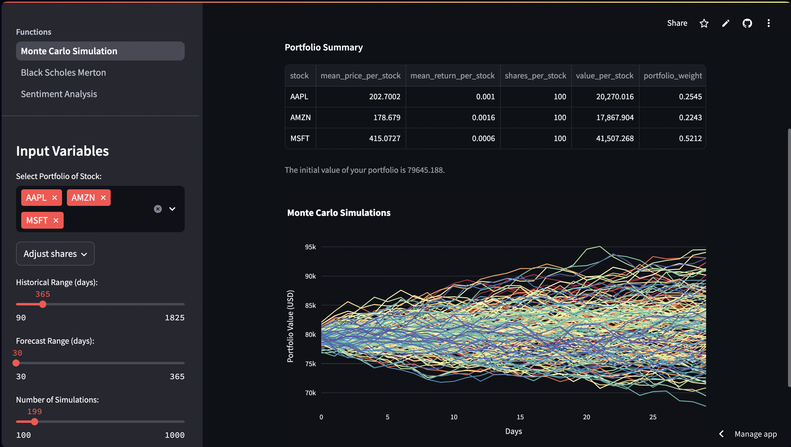

## Stock Evaluator

Index:
[1] Description
[2] Structure
[3] Dependencies
[4] Running the project
[5] ToDo

#### [1] Description

Web Application for Portfolio Stock Evaluation using Monte Carlo simulations, Black-Scholes-Merton model for Stock Options, and Sentiment Analysis. Provides a comprehensive overview of a chosen stock/portfolio based on gaussian simulations, theoretical option premium calculations and article reviews.



#### [2] Structure
```
stock_evaluator/
│
├── app.py                      # Streamlit app with options to select analysis and view results
│
├── backend/
│   ├── __init__.py             # Initialise backend packages
│   ├── black_scholes_merton.py
│   ├── monte_carlo.py
│   ├── sentiment_analysis.py  
│   ├── main.py                 # FastAPI app with endpoints for each analysis    
│   ├── utils/                  # Helper functions
│   │   ├── __init__.py
│   │   └── data_fetching.py    # Functions to fetch stock data from Yahoo Finance
│   └── models/     
│       ├── __init__.py            
│       └── sentiment_model.py        
│
├── streamlit/                  # Streamlit pages
│   ├── black_scholes_merton_app.py
│   ├── monte_carlo_app.py
│   └── sentiment_analysis_app.py  
│
├── notebooks/
│   └── ...                     # For feature experimentation
│
├── Dockerfile_backend
├── requirements.txt            # Dependencies
└── README.md
```

#### [3] Dependencies

**Python**
- python = "^3.11"

**General Packages**
- [numpy](https://pypi.org/project/numpy/)
- [pandas](https://pypi.org/project/pandas/)
- [yfinance](https://pypi.org/project/yfinance/)

**Interface**
- [fastapi](https://pypi.org/project/fastapi/)
- [streamlit](https://pypi.org/project/streamlit/)

**Function-Exclusive Packages**
*Black Scholes Merton*
- [scipy](https://pypi.org/project/scipy/)

*Sentiment Analysis*
- [beautifulsoup4](https://pypi.org/project/beautifulsoup4/)
- [contractions](https://pypi.org/project/contractions/)
- [gensim](https://pypi.org/project/gensim/)
- [nltk](https://pypi.org/project/nltk)

**Plotting**
- [matplotlib](https://pypi.org/project/matplotlib/)
- [plotly](https://pypi.org/project/plotly/)
- [seaborn](https://pypi.org/project/seaborn/)

*Refer to requirements.txt for more information on dependencies*


#### [4] Running the project

If any packages/dependencies are updated via poetry, be sure to export the requirements.txt using the following:
`poetry export --without-hashes -f requirements.txt -o requirements.txt`

For the end-state, imports of modules within the project are done using absolute filepaths. This is because of the nature of fastapi. To run specific files in isolation you will have to edit the imports (i.e. from backend.utils.data_fetching import WebScraper becomes from utils import Webscraper).

**Live version:**
- [Frontend](https://stock-evaluator-30590.streamlit.app)
- [Interactive Backend](https://stock-evaluator-djr5.onrender.com/docs)

*Note: It may take some time for the backend to initialise if it's asleep." Your IP may need to be given access to use the live versions*

**Backend Locally with Docker:**
1. Run `docker build -t image_name -f Dockerfile_backend .` in your command line
2. Run `docker run -p 0.0.0.0:80:80 image_name`
3. Open up `0.0.0.0:80/docs`
---
***Locally without Docker***
1. Frontend: Run `streamlit run app.py` in your command line
2. Backend: Run `fastapi run backend/main.py` in your command line
    API Docs: [For interactively testing backend functions](http://0.0.0.0:8000/docs)

#### [5] ToDo
- Add error handling for incorrect input values in streamlit
- Add error handling when backend hasn't initialised
- Fix web scraper inconsistency issues
- Fix streamlit web app issue with Black_Scholes_Merton_StockData class (works properly after restart)
- Fix caching issue with explanatory text on Monte Carlo page
- Clean up streamlit pages by moving functions to another .py
- Edit increments for streamlit user inputs
- Edit WebScraper class to behave in a more OOP way, returning objects
- Only use pickle for models, use JSON for dict
- Edit risk metrics summary table to return data to frontend, instead of image (create table in streamlit)
- Input descriptive information for streamlit pages from JSON as opposed to hard-code markdown